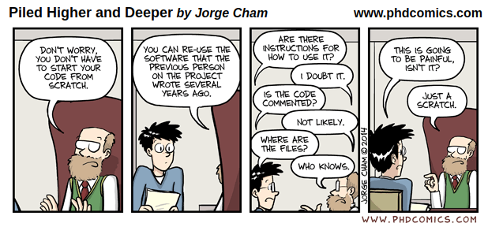
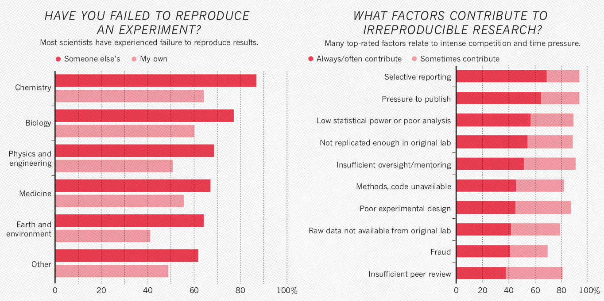
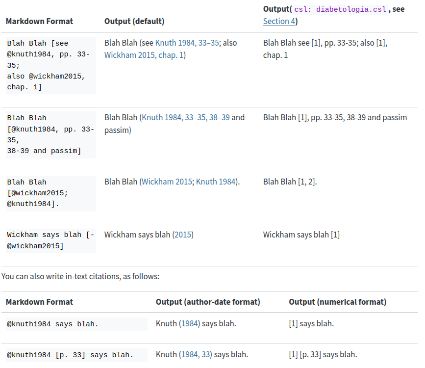

# Plan para el taller

**Reproducibilidad en la ciencia**

-   Experiencia personal - ¿Alguna vez has tratado de reproducir tus propios resultados y te ha parecido difícil?

-   Experiencia corriendo el código de alguien más - ¿Alguna vez has encontrado el artículo que podría ser perfecto para aprender a hacer un análisis pero su código no se entiende?

{width="674"}

{width="1024"}

-   Hay muchos factores que explican la irreproducibilidad

    -   Datos originales no disponibles
    -   Software no disponible o actualizado
    -   **No está suficientemente documentado** y/o es difícil seguir los pasos

-   Hay muchos pasos para alcanzar la reproducibilidad - Hay que aprender poco a poco

-   [Ejemplo de repositorio real](https://github.com/JulietteArchambeau/GOPredEvalPinpin?tab=readme-ov-file) - Juliette Archambeau

-   [Ejemplo documento reprohack](https://r-ladies-morelia.github.io/Reprohack2024/Grupo2/docs/index.html) y [repo](https://github.com/R-Ladies-Morelia/Reprohack2024/tree/main/Grupo2)

------------------------------------------------------------------------

**¿Qué es Quarto?**

-   Es un sistema de publicación científica y técnica.

-   Busca facilitar la combinación de texto y código, la publicación de contenido en múltiples formatos, permitir el uso de múltiples lenguajes de programación en una misma plataforma.

-   Se pueden crear documentos (pdf, word, html), páginas web, blogs, presentaciones, dashboards, libros, manuscritos, aplicaciones interactivas (shiny), entre otras cosas.

-   [Galeria](https://quarto.org/docs/gallery/)

------------------------------------------------------------------------

**Objetivo del taller**

-   Introducción a la creación de documentos html en Quarto

-   Introducción a los [manuscritos](https://sofiazorrilla.github.io/taller_quarto_ms/) en Quarto

------------------------------------------------------------------------

1.  ¿Cómo hacer un documento de quarto? (html)

    -   Creación de documento html

    -   Tarea: generar el 'notebook' DataExploration

        -   Visual vs source mode

        -   Yml

        -   Texto en md

        -   Código

        -   Insertar imágenes

        -   Insertar links

        -   Opciones de visualizacion de chunks

        -   Fórmulas matemáticas

        -   Código inline

    ------------------------------------------------------------------------

2.  ¿Cómo hacer un proyecto de manuscrito en quarto?

    -   Crear [template](https://github.com/quarto-ext/manuscript-template-rstudio) en github - (use this template)

    -   Clonar el repositorio de github de manera local (se puede descargar el mio como zip para trabajar)

    -   Modificar el index.qmd

        -   Modificar metadatos

        -   Modificar texto

        -   Insertar citas

        -   

        -   Revisar embeds

        -   Sustituir notebooks por los mios (o correr los que vienen por default)

        -   Revisar crossreferences de tablas y articulos (comentar cómo hacerle para que se incluyan las tablas)

        -   Comentar de dónde se pueden obtener los [formatos](https://github.com/quarto-journals/) para las revistas y cómo se pueden [crear](https://quarto.org/docs/journals/formats.html).

        -   Renderizar version final

        -   Explicar proceso de publicación en github.
